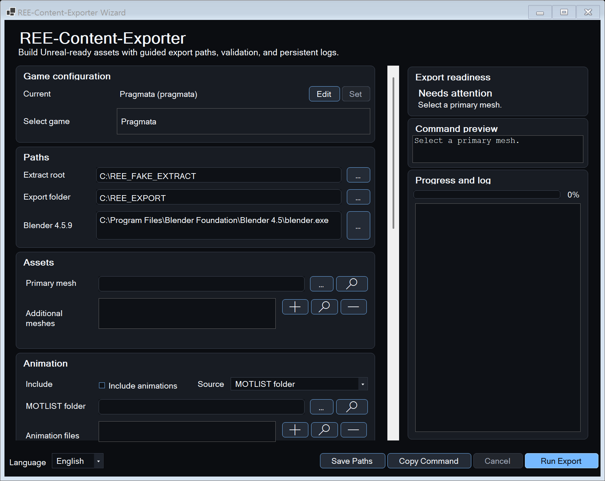
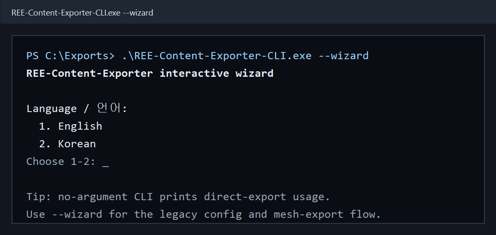

# REE-Content-Exporter

| GUI wizard | Legacy CLI wizard |
| --- | --- |
|  |  |

REE-Content-Exporter is a small export wizard built on top of REE-Content-Editor / RE-Engine-Lib. It helps move supported RE Engine meshes, materials, textures, skeletons, and animations into Blender, Unreal, or other DCC/game-engine workflows.

Version 0.6 opens as a Windows GUI wizard by default. The tool remains game-configurable and is no longer a PRAGMATA-only workflow.

## English

### What You Need

- A loose-file extract of the RE Engine game you want to export from.
- Blender 4.5.9 LTS when using the Unreal-ready FBX workflow.
- The release package of REE-Content-Exporter, or a local developer build prepared with the matching REE-Content-Editor dependency.

### Dependencies and Credits

REE-Content-Exporter is a wrapper around, and depends on, these upstream projects:

- [REE-Content-Editor](https://github.com/kagenocookie/REE-Content-Editor) and [RE-Engine-Lib](https://github.com/kagenocookie/RE-Engine-Lib) by kagenocookie provide the core RE Engine file loading, conversion, and export pipeline.
- [REE.PAK.Tool](https://github.com/Ekey/REE.PAK.Tool) by Ekey provides the public game file lists used by the wizard for asset search and game metadata.
- [Blender](https://www.blender.org/) is required for the Unreal-ready FBX re-export workflow.
- [Assimp](https://github.com/assimp/assimp) through [AssimpNetter](https://github.com/Saalvage/AssimpNetter) is used by the upstream exporter stack for scene import/export.
- [DirectXTex](https://github.com/microsoft/DirectXTex), `texconv.exe`, and [Hexa.NET.DirectXTex](https://github.com/HexaEngine/Hexa.NET.DirectXTex) support DDS/PNG texture conversion.
- GDeflateNet, the wrapper bundled by the upstream dependency around [GDeflateCore](https://github.com/neptuwunium/GDeflateCore), supports GDeflate-compressed RE Engine texture payloads.

Release packages bundle the required runtime files beside the executables: `texconv.exe`, `DirectXTex.dll`, `libGDeflate.dll`, and `assimp.dll`.

### First Run

Open `REE-Content-Exporter-GUI.exe`.

Choose the game from the dropdown and save it. The wizard downloads the matching `.list` file from Ekey's REE.PAK.Tool repository and saves that choice in `config.json`.

After a game is saved, the wizard locks that choice and shows the current game configuration at the top of the window, for example:

`Current game configuration: Pragmata (delete the "game" line from config.json to set a different game)`

To change games later, delete only the `game` line from the config file or use the GUI's Edit action.

CLI users can run `REE-Content-Exporter-CLI.exe`. Double-clicking the CLI executable with no arguments shows usage and waits for Enter so the temporary Windows console does not close immediately. The legacy console wizard is still available by running `REE-Content-Exporter-GUI.exe --wizard` or `REE-Content-Exporter-CLI.exe --wizard`. `REE-Content-Exporter-GUI.exe --config "<config.json>"` opens the GUI with that config. CLI input errors print `ERROR:` and exit nonzero instead of crashing with an unhandled .NET exception. Advanced command-line details are in the AI-oriented reference document.

### Normal Workflow

1. Select or confirm the game extract folder and export folder.
2. Pick the primary mesh from disk or search the selected game's downloaded list.
3. Add extra mesh parts if the asset needs them.
4. Choose animation, texture, scale, LOD, occlusion, and streaming options with the GUI controls. Skeletal animation sources can be MOTLIST folders, MOTLIST files, or raw MOT files. In the console wizard, detected skeletal meshes suggest animation candidates automatically when matching MOTLIST or MOT paths are found in the selected game's list.
5. Confirm the output path.
6. Run the export and watch the percentage progress bar and log window.

The GUI shows the generated command preview before export and writes progress output into the log window while the export runs. Export options use the legacy CLI wizard defaults unless you switch the export options dropdown to Custom. The language dropdown in the bottom-left corner is saved and restored on the next run.

Each GUI export also writes an explicit per-run debug log beside the requested output path. The log starts as `*-GUI-RUN__<timestamp>.log` and is renamed to `*-GUI-SUCCESS__<timestamp>.log` or `*-GUI-FAIL__<timestamp>.log` when the run ends.

The GUI uses a dark theme with pale-blue-accented rounded buttons. Hovering over path fields, list rows, and Find-dialog results previews the full path so long game asset paths are not hidden by clipped text.

The animation name filter is optional. It filters selected MOTLIST or MOT animations by name and is not an animation file path.

### Detailed Reference

The full command-line reference, game ID table, release packaging notes, and AI-agent operating details have moved to [docs/ai_cli_reference.md](docs/ai_cli_reference.md). Human users can read it too, but it is intentionally detailed and primarily meant for AI agents and advanced maintenance work.

## 한국어

### 필요한 것

- 내보낼 RE Engine 게임의 loose-file 추출 폴더.
- Unreal-ready FBX 워크플로를 사용할 경우 Blender 4.5.9 LTS.
- REE-Content-Exporter 릴리스 패키지 또는 일치하는 REE-Content-Editor 의존성이 준비된 로컬 개발 빌드.

### 의존성 및 크레딧

REE-Content-Exporter는 다음 업스트림 프로젝트를 감싸서 사용하는 래퍼입니다.

- kagenocookie의 [REE-Content-Editor](https://github.com/kagenocookie/REE-Content-Editor)와 [RE-Engine-Lib](https://github.com/kagenocookie/RE-Engine-Lib)는 RE Engine 파일 로딩, 변환, 내보내기 파이프라인의 핵심을 제공합니다.
- Ekey의 [REE.PAK.Tool](https://github.com/Ekey/REE.PAK.Tool)은 마법사의 에셋 검색과 게임 메타데이터에 쓰이는 공개 게임 파일 목록을 제공합니다.
- [Blender](https://www.blender.org/)는 Unreal-ready FBX 재내보내기 워크플로에 필요합니다.
- [Assimp](https://github.com/assimp/assimp)와 [AssimpNetter](https://github.com/Saalvage/AssimpNetter)는 업스트림 exporter 스택의 scene import/export에 사용됩니다.
- [DirectXTex](https://github.com/microsoft/DirectXTex), `texconv.exe`, [Hexa.NET.DirectXTex](https://github.com/HexaEngine/Hexa.NET.DirectXTex)는 DDS/PNG 텍스처 변환을 지원합니다.
- 업스트림 의존성에 포함된 GDeflateNet 래퍼와 그 기반인 [GDeflateCore](https://github.com/neptuwunium/GDeflateCore)는 GDeflate 압축 RE Engine 텍스처 payload 처리를 지원합니다.

릴리스 패키지는 실행 파일 옆에 필요한 런타임 파일인 `texconv.exe`, `DirectXTex.dll`, `libGDeflate.dll`, `assimp.dll`을 함께 포함합니다.

### 첫 실행

`REE-Content-Exporter-GUI.exe`를 실행하세요.

드롭다운에서 게임을 선택하고 저장하세요. 마법사는 Ekey의 REE.PAK.Tool 저장소에서 해당 `.list` 파일을 다운로드하고 선택한 게임을 `config.json`에 저장합니다.

게임이 저장된 뒤에는 선택이 잠기며, 창 상단에 다음과 같은 현재 게임 구성이 표시됩니다.

`현재 게임 구성: Pragmata (다른 게임을 설정하려면 config.json 파일에서 "game" 줄을 삭제하세요)`

나중에 다른 게임으로 바꾸려면 config 파일에서 `game` 줄만 삭제하거나 GUI의 Edit 동작을 사용하세요.

CLI 사용자는 `REE-Content-Exporter-CLI.exe`를 실행할 수 있습니다. CLI 실행 파일을 인수 없이 더블클릭하면 사용법을 표시하고 Enter 입력을 기다리므로 임시 Windows 콘솔이 바로 닫히지 않습니다. 기존 콘솔 마법사는 `REE-Content-Exporter-GUI.exe --wizard` 또는 `REE-Content-Exporter-CLI.exe --wizard`로 실행할 수 있습니다. `REE-Content-Exporter-GUI.exe --config "<config.json>"`는 해당 설정 파일로 GUI를 엽니다. CLI 입력 오류는 처리되지 않은 .NET 예외로 충돌하지 않고 `ERROR:`를 출력한 뒤 0이 아닌 종료 코드로 끝납니다. 자세한 명령줄 정보는 AI용 참고 문서에 있습니다.

### 일반 사용 흐름

1. 게임 추출 폴더와 내보내기 폴더를 선택하거나 확인합니다.
2. 디스크에서 기본 메시를 선택하거나 선택한 게임의 다운로드된 목록에서 검색합니다.
3. 필요한 경우 추가 메시 파트를 더합니다.
4. GUI 컨트롤로 애니메이션, 텍스처, 스케일, LOD, occlusion, streaming 옵션을 선택합니다. 스켈레탈 애니메이션 소스는 MOTLIST 폴더, MOTLIST 파일, raw MOT 파일을 사용할 수 있습니다. 콘솔 마법사에서는 선택한 게임 목록에서 일치하는 MOTLIST 또는 MOT 경로를 찾으면 감지된 스켈레탈 메시의 애니메이션 후보를 자동으로 제안합니다.
5. 출력 경로를 확인합니다.
6. 내보내기를 실행하고 백분율 진행률 표시줄과 로그 창을 확인합니다.

GUI는 내보내기 전에 생성된 명령 미리보기를 보여주며, 실행 중 진행 출력을 로그 창에 기록합니다. 내보내기 옵션은 기본적으로 기존 CLI 마법사 기본값을 사용하며, export options 드롭다운을 Custom으로 바꾸면 직접 설정할 수 있습니다. 왼쪽 아래의 언어 드롭다운은 저장되며 다음 실행 때 유지됩니다.

GUI 내보내기는 요청한 출력 경로 옆에 실행별 디버그 로그 파일도 기록합니다. 로그는 `*-GUI-RUN__<timestamp>.log`로 시작하고 실행이 끝나면 `*-GUI-SUCCESS__<timestamp>.log` 또는 `*-GUI-FAIL__<timestamp>.log`로 이름이 바뀝니다.

GUI는 어두운 테마와 옅은 파란색 강조색의 둥근 버튼을 사용합니다. 경로 입력칸, 목록 행, Find 대화상자 결과 위에 마우스를 올리면 긴 게임 에셋 경로가 잘려 보이지 않도록 전체 경로를 미리 볼 수 있습니다.

애니메이션 이름 필터는 선택 사항입니다. MOTLIST 또는 MOT에서 선택된 애니메이션을 이름으로 거르는 기능이며, 애니메이션 파일 경로가 아닙니다.

### 자세한 참고 문서

전체 명령줄 참고, 게임 ID 표, 릴리스 패키징 메모, AI 에이전트 작업 세부사항은 [docs/ai_cli_reference.md](docs/ai_cli_reference.md)로 이동했습니다. 사람도 읽을 수 있지만, 내용이 복잡하기 때문에 주된 대상은 AI 에이전트와 고급 유지보수 작업입니다.

Standalone MOT bone-loading correction details are documented in [docs/standalone_mot_loading_fix.md](docs/standalone_mot_loading_fix.md).
MOT quaternion continuity and FBX rotation anomaly handling are documented in [docs/animation_quaternion_continuity.md](docs/animation_quaternion_continuity.md).
The scoped MOTLIST verification for `ch0100_Other_5215_Turn_Walk_L180` is documented in [docs/ch0100_other_5215_rotation_continuity_verification.md](docs/ch0100_other_5215_rotation_continuity_verification.md).
